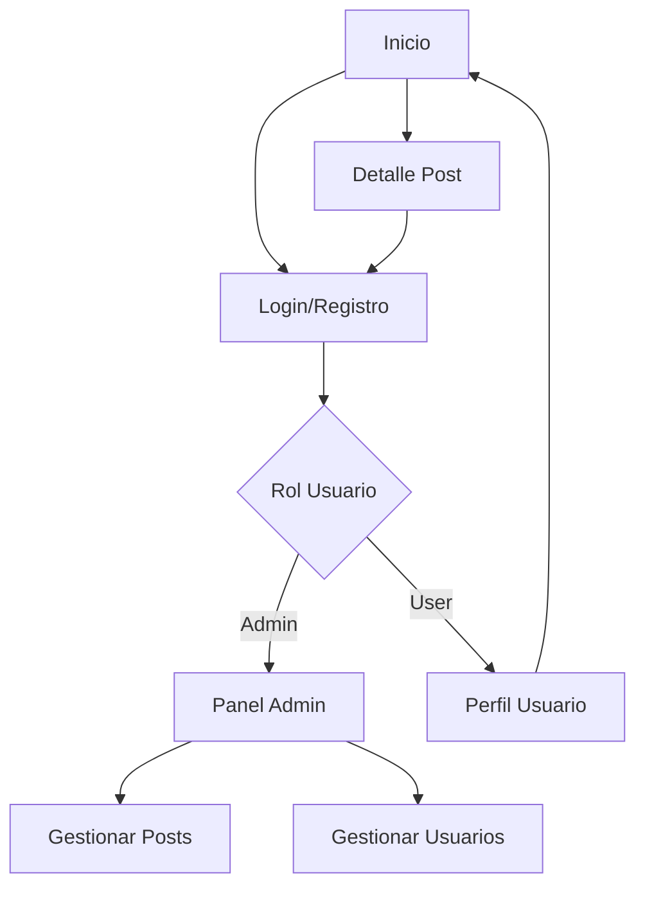

# Mapa de Navegación - Book Project

Este esquema define la arquitectura de información del sitio web, dividido en áreas públicas, de usuario y de administración.

## Estructura General

### 1. Zona Pública (Accesible a todos)
*   **Inicio (Home/Landing)**
    *   Hero Section (Post Destacado)
    *   Listado de últimos posts
    *   Sidebar de filtros/categorías
*   **Detalle de Post (Vista Individual)**
    *   Contenido completo del artículo
    *   Sección de comentarios
    *   Posts relacionados
*   **Autenticación**
    *   Login
    *   Registro

### 2. Zona de Usuario Registrado
*   **Perfil de Usuario**
    *   Editar datos personales
*   **Mis Comentarios** (Opcional)

### 3. Zona de Administración (Protegida)
*   **Dashboard / Panel de Control**
    *   Resumen de métricas
*   **Gestión de Posts**
    *   Crear Post
    *   Editar Post
    *   Eliminar Post
*   **Gestión de Usuarios**
    *   Listado de usuarios
    *   Cambiar roles / Banear

## Flujo de Navegación Principal

